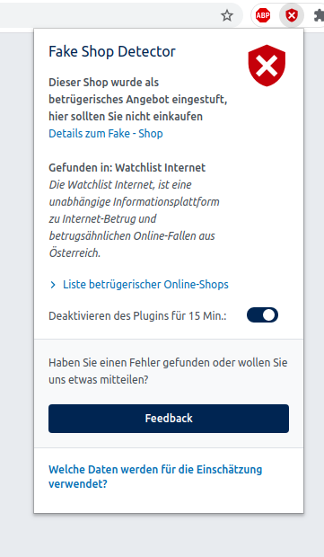
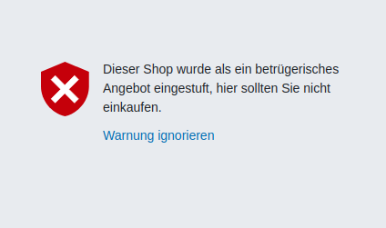
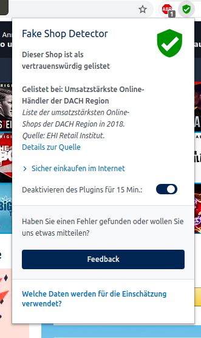
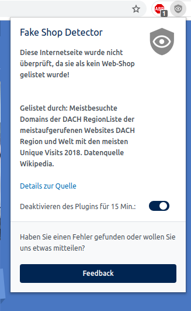

# Fake Shop Detection Plugin / fake-shop-detection_plugin

## About / Synopsis

* The Fake Shop Detector is a browser plugin developed for Chromium-based browsers and Firefox that analyzes in real time whether a online store is legitimate or fraudulent.
The Fake Shop plugin communicates with the REST API and caches the different lists. After 24 hours these lists are reloaded. The caching ensures that the user's surfing behaviour is not monitored.
* Project status: working/prototype
* Contact andrew.lindley@ait.ac.at

## Table of contents

> * [Fake Shop Detection Plugin / fake-shop-detection_plugin](#title--repository-name)
>   * [About / Synopsis](#about--synopsis)
>   * [Table of contents](#table-of-contents)
>   * [Requirements](#requirements)
>   * [Installation](#installation)
>   * [Usage](#usage)
>     * [Screenshots](#screenshots)
>   * [Resources (Documentation and other links)](#resources-documentation-and-other-links)
>   * [License](#license)
>   * [About Nuxeo](#about-nuxeo)

## Requirements
The following requirements are only needed if the code will be changed, for simple installing it, they are not needed.
* [NPM](https://www.npmjs.com/get-npm)
* [GULP](https://gulpjs.com/docs/en/getting-started/quick-start/)

## Installation
### For development
#### Chromium-based browser
* Go to chrome://extensions
* Activate developer mode
* Click "Load unpacked"
* choose the dest folder
* the plugin is installed
### Firefox
* Got to about:debugging#/runtime/this-firefox
* Click on "Load temporary addon"
* choose manifest.json in dest folder
* the plugin is installed
### Screenshots

## Resources (Documentation and other links)
* [Chrome Developers Extention Guide](https://developer.chrome.com/docs/extensions/mv3/devguide/)
* [Mozilla Extention Guide](https://developer.mozilla.org/en-US/docs/Mozilla/Add-ons/WebExtensions/Your_first_WebExtension)

## License

[European Union Public License, Version 1.2](https://eupl.eu/1.2/en/)

The work is based on results carried out in the research project [MAL2 project](https://projekte.ffg.at/projekt/3044975), which was partially funded by the Austrian Federal Ministry for
Climate Action, Environment, Energy, Mobility, Innovation and Technology (BMK) through the ICT
of the future research program managed by the Austrian federal funding agency (FFG).
* Austrian Institute of Technology GmbH, Center for Digital Safety and Security [AIT](https://www.ait.ac.at/)
* Austrian Institute for Applied Telecommunications [ÖIAT](https://www.oiat.at)
* X-NET Services GmbH [XNET](https://x-net.at/de/)
* Kuratorium sicheres Österreich [KSÖ](https://kuratorium-sicheres-oesterreich.at/)
* IKARUS Security Software [IKARUS](https://www.ikarussecurity.com/)

## About MAL2

The MAL2 project applies Deep Neural Networks and Unsupervised Machine Learning to advance cybercrime prevention by a) automating the discovery of fraudulent eCommerce and b) detecting Potentially Harmful Apps (PHAs) in Android. 
The goal of the MAL2 project is to provide (i) an Open Source framework and expert tools with integrated functionality along the required pipeline – from malicious data archiving, feature selection and extraction, training of Machine Learning classification and detection models towards explainability in the analysis of results (ii) to execute its components at scale and (iii) to publish an annotated Ground-Truth dataset in both application domains. To raise awareness for cybercrime prevention in the general public, two demonstrators, a Fake-Shop Detection Browser Plugin as well as a Android Malware Detection Android app are released that allow live-inspection and AI based predictions on the trustworthiness of eCommerce sites and Android apps.

More information is available at [www.malzwei.at](http://www.malzwei.at).

